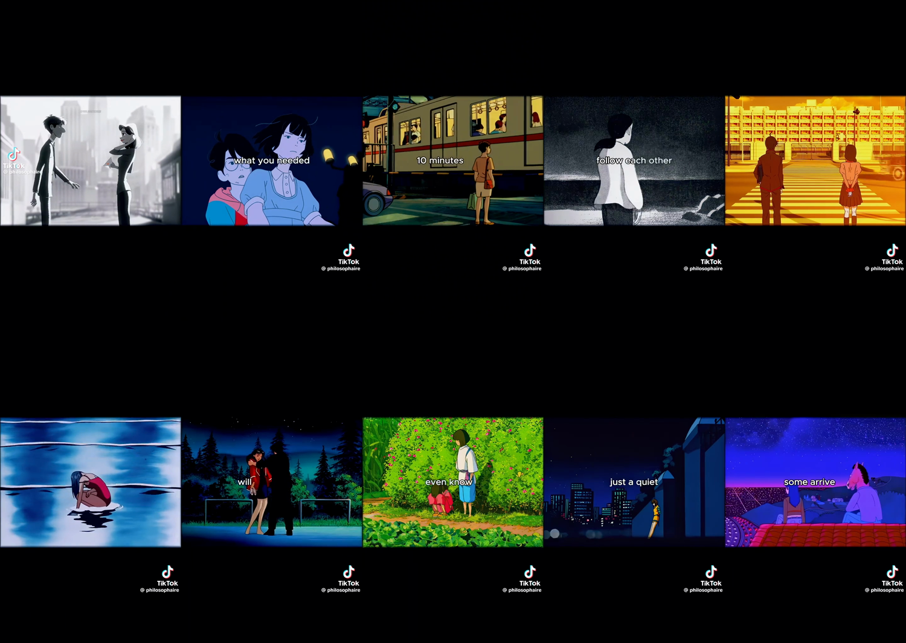

# 6. Teardown of the reference video

The example video from the course — a @philosophaire post, TikTok watermark still baked in.

## Measured facts

| Property | Measured | Required for Creator Rewards |
|---|---|---|
| Resolution | **576 × 1024** | 1080 × 1920 |
| Duration | 71.6 s | over 60 s — **this one passes** |
| Top black bar | **303 px** | 0 |
| Bottom black bar | **160 px** | 0 |
| Active picture | 576 × 561 — **54.8% of the screen** | 100% |
| Dead black space | **45.2% of the frame** | 0% |
| Effective pixel count | 323,136 | 2,073,600 |
| Share of required pixels | **15.6%** | 100% |

Nearly half the screen is black. The picture that remains carries **one sixth** of the
pixels TikTok asks for. This is not a judgment call by a reviewer — it is measurable, and
it is the literal wording of the rejection: *"black screens."*

## What the footage actually is

Reading the frames: Studio Ghibli (*Whisper of the Heart*, *Spirited Away*, *Ocean Waves*),
*BoJack Horseman* (Netflix), *Into the Spider-Verse* (Sony), Makoto Shinkai train sequences.

These are not "GIFs." They are clips from copyrighted feature films and series owned by
Ghibli, Netflix, and Sony. There is **zero original footage** in the video — no frame of it
was created by the person who posted it. That is "random shots" in the policy text, and it
is also a copyright exposure independent of monetization.

The TikTok watermark reading `@philosophaire` is baked into the frames, which means this
copy was re-downloaded from TikTok. Editing from a file like this carries the watermark
into your video — an automatic quality flag on its own.

## What the video does well — keep these

Be fair to it. This format gets views, and your own 2.1M video proves it works. What makes
it work is **not** the Ghibli clips:

1. **Duration: 71.6 seconds.** The one Creator Rewards requirement it meets. Your 38-second
   video does not. Match this.
2. **Caption pacing.** 2–4 words on screen at a time, changing with the voice. Very readable.
3. **Emotional register.** Quiet, wistful, unresolved. Consistent from first frame to last.
4. **One image per beat.** A new visual on every pause. Never two ideas on one shot.
5. **Colour arc.** Grey → blue night → gold → green → night sky. The palette moves with the
   emotion instead of staying flat.

Every one of those five is **portable**. None of them requires stolen footage.

## The decision you actually have to make

Two different games, and this format can only win one:

| | Views | Creator Rewards |
|---|---|---|
| Ghibli clips, letterboxed | Works well | **Permanently ineligible** |
| Your own / self-generated visuals, full bleed | Works well | **Eligible** |

You are not choosing between "good videos" and "boring videos." You are choosing between
two sources for the pictures. The script, the pacing, the mood — the things that made
2.1M people watch — do not change at all.

## Rebuilding this exact video, legitimately

Take the same script, same pacing, same 71 seconds. Change only the source of the pictures:

1. **Storyboard from the reference.** Write out the beats: *two people facing each other on
   a grey street → girl on a train platform at night → figure walking away on a beach →
   crossing at golden hour → someone alone in water → two people on a roof under stars.*
   That structure is not owned by anyone. Emotional beats are not copyrightable.
2. **Generate each beat yourself**, 9:16 native, 1080×1920. Prompt for the register you want —
   *"anime-style illustration, wistful, muted palette, wide shot, lone figure, night"* — and
   generate 3 takes per beat, keep the best. Label AI content with TikTok's tool.
3. **Or shoot the same beats.** A train window, a crossing at sunset, a silhouette on a
   beach — you can film every one of those on a phone. Grade them cold and grainy and they
   sit in exactly the same emotional world.
4. **Full bleed.** No 4:3 project, no masking, no framing. 1080×1920 edge to edge from the
   first step. You gain back 45% of the screen — the video is nearly twice as large on the
   viewer's phone, which helps retention too, not just eligibility.
5. **Your voice, your script.** Keep the 5 techniques above; write the words yourself.

Same video. Same feeling. Yours, and payable.
