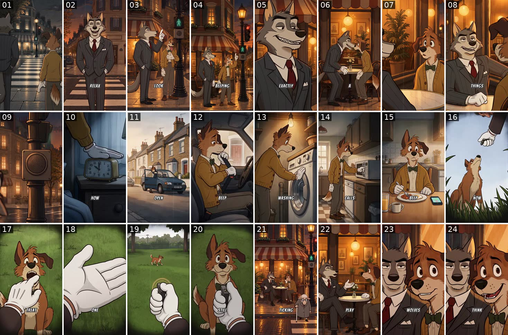
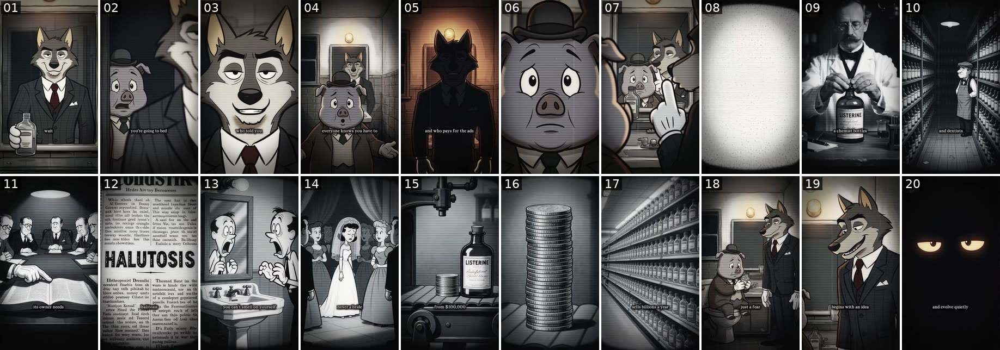
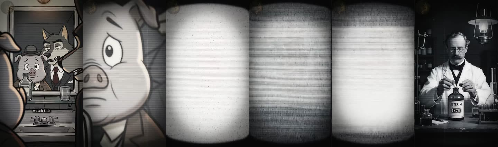

# 10. Quiet Wolf teardown: two reference videos, frame by frame

The two videos you sent are both from **Quiet Wolf** ([@quietwolfz](https://youtube.com/@quietwolfz)).
Everything below was measured from the files or read from the channel. Nothing is estimated
from memory.

| File you sent | Episode on the channel | Length |
|---|---|---|
| `ssstik.io_quietwolff_…_1.mp4` | **"The Beep Is Training You"** (YouTube `5hkXU00Taoc`) | 1:22.6 |
| `SSSTik.vn_…_2.mp4` | **"The Word That Turned Breath Into a Disease"** (YouTube `X3SZcS-IRyQ`) | 1:19.9 |

**Method:** I viewed every frame at 2 fps (325 frames) and every cut again at 10 fps. Cuts
were found with ffmpeg scene detection (threshold 0.08) and checked by eye. Line timings come
from the burned-in captions and are accurate to about ±0.25 s. The exact wording comes from
the YouTube transcripts. Audio was measured with EBU R128 loudness, silence detection and a
spectrogram.

---

## 1. The channel

| | Value (5 Oct 2026) |
|---|---|
| Created | 5 Sep 2026 (one month old) |
| Uploads | 20 Shorts, all 60–116 s |
| Subscribers | 4,440 (it was 1,310 on 1 Oct, so it more than tripled in 4 days) |
| Total views | 67,408 |
| Best performers | "what kind of world have we ended up in ?" 7.1K · "The One Room That Never Changed" 5.2K · "How they managed to sell you water" 4.0K · "Who Really Invented Black Friday?" 3.8K (breakout 3.7×) · "The one who gossips to you… gossips about you." 1.4K in its first day (breakout 4.7×) |
| Your two | Beep: 3,126 views · Breath: 2,571 views |

The **wolf in a suit is the permanent master**. The companion changes from episode to episode:
a dog (Beep), a pig (Breath), and a son in the gossip episode ("Why the long face, son?").

---

## 2. Measured specs

| | Video 1: Beep | Video 2: Breath |
|---|---|---|
| Resolution of your copy | 576×1024 (a TikTok re-download, already re-compressed) | 1080×1920 |
| Frame rate / codec | 30 fps, H.264 1.0 Mb/s | 30 fps, HEVC 1.1 Mb/s |
| Audio | AAC 32 kb/s stereo | AAC 64 kb/s stereo |
| Loudness | −22.8 LUFS integrated, LRA 4.1 | −21.5 LUFS integrated, LRA 6.6 |
| Shots | **23** | **19** |
| Average shot length | 3.6 s | 4.2 s (3.3 s if you leave out the 20 s closing shot) |
| Spoken words | 187 (**2.3 words/s**) | 210 (**2.6 words/s**) |
| Explanation section | 0:25.0–0:53.5 = **28.5 s (35%)** | 0:17.5–0:55.6 = **38 s (48%)** |
| Colour | Full colour; warm amber night, cold blue bedroom, daylight street | Desaturated / black and white with sepia moments, scanlines, rounded CRT vignette |
| Captions | **One word at a time**, bold comic-style capitals, white with a black outline, centred about 76% down the frame | **2–5 words**, small lowercase serif, white, no box, about 75% down |
| Logo | None | Faint round wolf-profile badge, top-left corner, on every frame |
| Music | Continuous bed: never quiet below −35 dB for more than 0.4 s | Continuous bed; one 0.4 s dip at 0:56.7 |
| Sound effects | Pure-tone beeps exactly on the word "beep" (seatbelt chime 0:31.8–0:36.1, phone 0:44); clicks | Static/whoosh burst on the TV transition (0:18.1–0:21.7); stamp; coins |

---

## 3. Video 1, "The Beep Is Training You": shot by shot


*One frame per shot. Tile 24 is the end of shot 23.*

**Cast:** the wolf (grey, cream muzzle, heavy black brows, half-closed eyes, pinstripe
three-piece suit, red tie, pocket square, white gloves) and the dog (brown and cream, mustard
cardigan, green bow tie, white gloves, brown trousers).

| # | Time | On screen | Camera / edit | Dialogue |
|---|---|---|---|---|
| 1 | 0:00.0–0:02.4 | Night street with wet cobbles and a lamp-lit café corner. The wolf's back fills the left third of the frame. The dog stands at the kerb, then sprints onto the zebra crossing. The walk signal is green. | Static over-the-shoulder shot from behind the wolf; the dog runs away from camera | DOG: "Run. It's about to turn red." |
| 2 | 0:02.4–0:04.4 | The wolf, frontal medium-full shot, standing on the crossing with hands in pockets, eyes closed, calm smile | Static | WOLF: "Relax. We have time." |
| 3 | 0:04.4–0:12.4 | The dog runs across and pants beside the signal pole. The wolf strolls across, arrives beside him and points up at the green walking figure (0:08.5). | **One continuous ~8 s move**: from over the shoulder, tracking forward, settling into a side two-shot with a slow push | DOG (running): "Are you crazy? Hurry up." · DOG (panting): "Just in time." · WOLF (pointing): "Look, it's still green." · WOLF: "You ran and nobody asked you to." |
| 4 | 0:12.4–0:14.8 | Wide shot: café awning, signal pole on the right, red light above the green walking figure. The dog raises a finger. | Static wide | DOG: "The beeping. It went faster and faster." |
| 5 | 0:14.8–0:16.6 | Wolf close-up, three-quarter angle, smug. His eyes close on the word, then he turns away. | Static; cuts on his turn | WOLF: "Exactly." |
| 6 | 0:16.6–0:20.2 | From behind: the wolf's hand on the dog's shoulder as they walk under the awning and sit at a marble café table | Follows them, settles into a side two-shot | WOLF: "Let's grab a coffee. I have a theory about what just happened." |
| 7 | 0:20.2–0:21.6 | Dog close-up over the wolf's shoulder, curious brows | Static single over the shoulder | DOG: "What theory?" |
| 8 | 0:21.6–0:25.0 | Wolf medium close-up, seated, gloved hands folded, half-lidded smirk | Static reverse angle | WOLF: "How many things in your life beep? Really think about it." |
| 9 | 0:25.0–0:27.0 | The wolf's ear in the foreground, then a push-in on the crossing's push-button box until the **speaker grille fills the frame** | Fast push to extreme close-up. **No dialogue**; the ticking carries it. | — |
| 10 | 0:27.0–0:30.0 | Bedroom at night, cold blue: alarm clock on the nightstand; a cardigan sleeve and white glove slaps it | Static | WOLF (voice-over): "How many beeps today? Go on, count them." |
| 11 | 0:30.0–0:32.4 | Daytime British terraced street: the dog unlocks a small blue hatchback, opens the door and gets in | Static wide | "You open the car. Beep." |
| 12 | 0:32.4–0:38.9 | Car interior, dog in profile: he pulls the seatbelt across, buckles it, sighs, closes his eyes | Static side single; real chime 0:31.8–0:36.1 | "No seat belt. Beep beep beep. And it only stops when you obey." |
| 13 | 0:38.9–0:40.8 | Laundry corner under a warm bulb: the dog shuts the washing-machine door | Static medium | "The washing machine. Beep." |
| 14 | 0:40.8–0:43.0 | Kitchen wide, checkered floor: the dog walks to the microwave and opens it | Static wide | "The microwave calls. You answer." |
| 15 | 0:43.0–0:45.5 | Dog frontal at the breakfast table (eggs, beans, orange juice, coffee). The phone lights up and beeps (0:44); he grabs it. | Static medium | "Your phone. Beep. You come running." |
| 16 | 0:45.5–0:47.2 | Low angle in grass: **the companion is now drawn as an actual dog**, sitting, looking up at a white glove holding a clicker; sky behind. Brief white flash on the cut. | Low-angle static | "Now, how do you train a dog?" |
| 17 | 0:47.2–0:49.3 | The wolf's point of view: glove and clicker in the foreground, the dog (still in his bow tie) sitting in grass, heavy vignette. Each click draws **concentric sound rings**; the glove feeds a treat. | POV, static; the rings are a graphic overlay | "Click, a treat. Click, a treat." |
| 18 | 0:49.3–0:51.2 | Close-up of an empty open palm | Insert | "Then one day, no treat." |
| 19 | 0:51.2–0:52.7 | POV of a wide park: the dog is far away. Click (rings), and he runs straight to camera. | Static POV | "Click." |
| 20 | 0:52.7–0:53.5 | The dog sits in front of the clicker, smiling. The image darkens and desaturates, then **dips to black** (0:53.4–0:54.0). | Fade out | "And he still runs." |
| 21 | 0:53.8–1:00.7 | Fade up on a wide shot from across the street: the pair at the café table while an elderly sheep with a cane and glasses uses the crossing. Slow push-in. A hurrying dog in a flat cap, carrying a newspaper, walks through the foreground. | Slow push from wide to medium-wide. **The passer-by wipes the frame and hides the next cut.** | WOLF: "That ticking helps people who can't see. It works on everyone else, too." |
| 22 | 1:00.7–1:15.2 | Medium two-shot at the table: the wolf sits cross-legged; the dog rests his chin on his hand, then sits up. The wolf turns up an open palm for each example. | **Long take, 14.5 s**, slow push and slight reframe toward the wolf | WOLF: "It sped up. You ran." · DOG: "A sound can make me move." · WOLF: "Stores play slow music. You walk slower. Casino machines sing even when you lose. You're not so different from the dog." |
| 23 | 1:15.2–1:22.1 | Wolf frontal close-up, smug. At 1:19.3 **the dog leans into the frame cheek to cheek** and grins at the camera. | Static close-up; the dog enters the frame | WOLF: "My theory, some beeps are built to control you." · DOG (to camera): "Maybe he's right. Wolves, what do you think?" |
| — | 1:22.1–1:22.6 | Black | Cut | — |

**This episode has no TV and no "Watch this".** Its way into the explanation is shot 9, the
push-in on the speaker grille, followed by "Go on, count them." Every example then happens in
the companion's own life, and he plays the dog in the analogy.

---

## 4. Video 2, "The Word That Turned Breath Into a Disease": shot by shot


*One frame per shot. Tile 20 is the end of shot 19.*

**Cast:** the same wolf (here in a dark plain suit) and a grey pig (bowler hat, brown suit,
waistcoat, dark tie).

| # | Time | On screen | Camera / edit | Dialogue |
|---|---|---|---|---|
| 1 | 0:00.0–0:01.0 | The bathroom mirror fills the frame: in it, the wolf unscrews a mouthwash bottle; the pig appears in the doorway behind him | Static; desaturated, scanlines | PIG: "Wait," |
| 2 | 0:01.0–0:03.5 | Over the shoulder: the wolf's shoulder and smirk large and soft on the right; the pig sharp in the doorway, worried | Static, shallow focus on the pig | PIG: "you're going to bed without rinsing? What about your breath?" |
| 3 | 0:03.5–0:06.1 | Wolf frontal close-up, half-lidded smile | Static | WOLF: "Who told you your breath was a problem?" |
| 4 | 0:06.1–≈0:09.6 | Pig medium-full in the tiled bathroom, wolf behind him by the mirror; the pig shrugs with open palms | Static | PIG: "Everyone knows you have to. The ads, the dentist, everyone." |
| 5 | ≈0:09.6–0:12.4 | **The light drops**: the pig dissolves out and the wolf becomes a backlit silhouette under the bulb, warm sepia, one open-palm gesture | Lighting change and dissolve within the shot | WOLF: "And who pays for the ads and the dentist sign?" |
| 6 | 0:12.4–≈0:14.3 | Extreme close-up of the pig, eyes darting | Static; ends as the pig turns his head | PIG: "I never thought about it." |
| 7 | ≈0:14.3–0:18.0 | Whip around to over the pig's shoulder, into the mirror: both reflections. The wolf leans in and puts a **finger to his lips** (0:16.0), then the camera pushes through the reflection onto the pig's face. | Whip-turn in, then a push that continues into the next shot | WOLF: "Nobody's meant to." · "Shh." · "Watch this." |
| 8 | 0:18.0–0:20.9 | The pig's face blurs and **blooms to white** inside a rounded CRT-screen mask; a bright static band rolls through (0:20.0); grey noise | "TV switching on" transition; noise burst in the audio | — (3.5 s with no voice) |
| 9 | 0:20.9–0:26.0 | **Photoreal** black and white: a Victorian chemist (moustache, round glasses, bow tie, lab coat) corks a bottle labelled LISTERINE with **"1879" printed on the label** | Slow push to the label | WOLF (voice-over): "1879. A chemist bottles a powerful antiseptic and calls it Listerine." |
| 10 | 0:26.0–0:30.0 | Black-and-white cartoon: endless shelves of bottles, a bored shopkeeper in apron and flat cap | Static | "For decades, it just serves surgeons and dentists. Nobody ever buys it twice." |
| 11 | 0:30.0–0:34.0 | Boardroom of suited men under one lamp; a white glove points into an open dictionary | Slow push to the book | "By the 1920s, its owner needs a reason to sell it every single day. His chemist…" |
| 12 | 0:34.0–0:37.9 | Newspaper page; a rubber stamp slams a dripping headline that reads **"HALUTOSIS" (misspelled on screen)** | Stamp action | "…hand him a forgotten word. Halitosis, a fancy name for bad breath." |
| 13 | 0:37.9–0:41.6 | A 1930s "rubber-hose" style cartoon man at a mirror smells his breath in his palm and recoils in horror | Static | "They rebuild ordinary breath into a secret disease you can't smell on yourself." |
| 14 | 0:41.6–0:45.7 | A sad bride among bridesmaids while guests whisper behind their hands | Static | "Always a bridesmaid, never a bride. The ads sell a shame no friend will cure." |
| 15 | 0:45.7–0:49.9 | Bottles on a factory conveyor (motion-blur in); a **coin stack appears beside a bottle and grows** on the numbers | Blur transition | "In 7 years, sales leap from $100,000 to 8 million." |
| 16 | 0:49.9–≈0:51.8 | The coin stack now towers; it holds, then whip-pans away | 1.5 s hold, then a whip | — |
| 17 | ≈0:51.8–≈0:55.6 | **Whip-zoom down an endless supermarket aisle** of mouthwash | Whip-zoom, then hold | "Today, bad breath sells billions a year. And it was never a sickness," |
| 18 | ≈0:55.6–0:59.9 | Crossfade back to the bathroom: the pig sits on the toilet lid studying the bottle, the wolf stands over him, and the pig sets the bottle down | Crossfade in, static wide | "just a fear bottled." Then 2.5 s with no dialogue. |
| 19 | 0:59.9–1:19.9 | The wolf, three-quarter medium shot, then a **slow continuous push-in to close-up**. At 1:12.4 he turns to face the camera. From 1:15 the light fades until **only two glowing eyes** remain, and they narrow shut at the end. | **One 20 s shot**: push-in, head turn, fade to the eyes | WOLF: "Every fear you carry started as someone's reason to sell. Every choice you make begins with an idea they planted in your head. How many have you breathed in without ever noticing? You're free to think what they decide." · (to camera) "Or go quiet. Watch, learn, like, subscribe, and evolve quietly until you're the wolf." |

### The "Watch this" transition, frame by frame (0:14.3–0:21.0)


*0:16.8 · 0:18.3 · 0:19.0 · 0:20.1 · 0:20.6 · 0:21.2*

| Time | What happens |
|---|---|
| 0:14.3 | The pig turns his head and the camera whips around behind him (about 0.3 s). |
| 0:14.5–0:16.4 | In the mirror, the wolf leans to the pig's ear. Index finger to his lips on "Shh" (0:15.9). |
| 0:16.4–0:17.4 | "Watch this.", said with a smile, still in the reflection. |
| 0:17.5–0:18.0 | The push-in begins; the pig's face and eye grow until they fill the frame, softening. |
| 0:18.3–0:19.9 | White bloom. The corners go dark and rounded like an old TV screen, with scanlines. |
| 0:20.0 | One bright horizontal static band rolls through. |
| 0:20.5 | Grey noise field. |
| 0:20.9 | Hard cut to the archive, which plays **inside the same rounded TV frame** until 0:55.6. |

**There is no TV set in the room.** The "television" is entirely an editing look laid over
the push-in.

---

## 5. The formula, as written across five episodes

I read the transcripts of Beep, Breath, Water, Black Friday and Gossip. The beats repeat almost
word for word:

| Beat | Breath | Water | Black Friday |
|---|---|---|---|
| 1. Companion acts on an assumption | "Wait, you're going to bed without rinsing?" | "You're drinking tap water?" | "You're not buying anything? Black Friday ends in 1 hour." |
| 2. The master asks where the assumption came from | "Who told you your breath was a problem?" | "Who told you that you can't?" | "Who told you it ends?" |
| 3. The companion has no real source | "Everyone knows… the ads, the dentist, everyone." | "I heard it somewhere." | "The countdown. Everyone says so." |
| 4. The master names who benefits | "And who pays for the ads…?" | "From someone who does business in this field, maybe." | "Someone who sells things, maybe." |
| 5. The companion concedes | "I never thought about it." | "Now that you mention it." | "Now that you mention it." |
| 6. Cue | "Nobody's meant to. Shh. Watch this." | "Shh, not another word. Watch this." | "Shh. Not another word. Watch this." |
| 7. Explanation | Year, then who, then what they wanted, then the trick, then a number, then "Today" | 1977, a French company, plants two ideas, 3M bottles become 200M, "Then the truth" | Starts with "just a Friday": 1939, Fred Lazarus, then the doorbuster, then "The truth" |
| 8. Moral | "Every choice you make begins with an idea they planted in your head. How many have you **breathed in** without ever noticing?" | "…How many have you **swallowed** without noticing?" | "…How many have you **bought** without noticing?" |
| 9. Sign-off | "You're free to think what they decide, or go quiet. Watch, learn, like, subscribe, and evolve quietly until you're the wolf." | Same | Same |

The verb in the moral changes to fit the topic (breathed in, swallowed, bought). Everything else
is a fixed template.

**Variant episodes:**
- **Theory** (Beep): no explanation sequence. "Let's grab a coffee. I have a theory." Examples
  from the companion's own day, the companion plays the dog in the analogy, back to the table
  for real-world proof, then "My theory: …". The companion closes with a direct question to
  the audience ("Wolves, what do you think?").
- **Parable** (Gossip): "Sit down and watch this." The explanation is a fictional fable (a
  magpie) instead of history.

---

## 6. Your master prompt compared with what the videos actually do

Keep what already matches. Change or add the rest.

**Already matches**
- Starting mid-action, a concrete question, the companion registering it, then "Watch this"
  into a full-frame explanation and back to the room. That is beats 1–8 exactly.
- "Match every spoken claim to a visible example" is what Breath does in nearly every shot.
  Numbers are carried by objects: the year printed on the bottle label, sales shown as a
  growing coin stack, "billions" shown as an endless aisle.
- Exact screen text added in editing, never generated. Breath shows why: the generated headline
  says **"HALUTOSIS"** and the newspaper body text is gibberish.
- No permanent catchphrase. Good. "Evolve quietly until you're the wolf" is Quiet Wolf's
  brand; don't reuse it.

**Differences to decide on deliberately**
1. **The TV.** Your prompt has the master physically turning a TV on. Quiet Wolf has no TV set:
   it pushes into the listener's face and lays a TV look over the cut. Both work, and a real TV
   is your own twist. If you keep it, push the camera into the *TV screen*, then bloom, one
   static roll, and play the explanation inside a rounded screen frame.
2. **Length.** Your prompt defaults to 60 s. Both references run 80–83 s, the channel's Shorts
   run 60–116 s, and [`03-technical-spec.md`](03-technical-spec.md) says **65–90 s** for
   Creator Rewards. Change the default to about 75 s.
3. **The explanation is 35–48% of the runtime**, not "a substantial part". Put a number in the
   prompt.
4. **Height is reversed.** In both sources the master is the taller one. In yours, the master
   is half the companion's height. Quiet Wolf runs its longest dialogue seated at a café table
   (Beep shot 22), which evens out eyelines. Seat your pair (stools, a counter, a bench) for
   long exchanges. Use alternating single shots (Breath shots 2/3/6) instead of a standing
   two-shot where the master would be tiny in a 9:16 frame.
5. **Captions: pick one style per series.** Beep's one-word bold captions are loud. Breath's
   2–5 word lowercase serif captions are calm and documentary. Your muted look fits the
   Breath style.
6. **Visual style inside the TV.** Breath mixes photoreal black and white (the 1879 chemist),
   1930s rubber-hose cartoon (the ads era) and clean product/coin shots. Your prompt's
   "consistent drawn editorial treatment" is the better rule. A photoreal "chemist" is an
   invented face that viewers can mistake for a real archive photo.
7. **Add a closing-shot rule.** Both endings rely on one long, held shot. Breath: 20 s slow
   push-in, a head turn to camera, then the light fades to just the eyes. Beep: the companion
   leans into the master's close-up and speaks to the audience.
8. **Add sound rules.** A continuous music bed under everything. A literal sound effect for
   every sound the dialogue names (the beep lands on the word "beep", the click on "click",
   coins on the sales figure). A 1.5–3.5 s **dialogue-free beat at every transition** (Beep
   0:25.3–0:27.8 and 0:53.4–0:55.9; Breath 0:17.4–0:21.0 and 0:57.9–1:00.4).
9. **A second episode type.** Beep shows a cheaper format with no explanation sequence: the
   examples happen in the companion's own world. Add it as an option next to "Watch this".

**Facts in Breath compared with sources**

| Claim in the video | Verdict |
|---|---|
| 1879, a chemist makes an antiseptic called Listerine | ✅ Joseph Lawrence, St. Louis, named after Joseph Lister |
| Served surgeons and dentists for decades | ✅ Broadly right; it became a mainstream mouthwash after the 1920s campaign |
| 1920s owner pushes "halitosis" | ✅ Gerard Lambert's campaign |
| "$100,000 to 8 million in 7 years" | ✅ Rounded: commonly cited as **$115,000 → over $8 million** |
| "Always a bridesmaid, never a bride" | ❌ The 1925 ad said **"Often a bridesmaid but never a bride"** |
| "It was never a sickness" | ⚠️ Overstated. Halitosis is a real clinical complaint; the ads exaggerated how common it was and what it cost people. |
| "Nobody ever buys it twice" | ⚠️ Dramatisation, not a documented fact |

Your prompt's "verify the facts and keep necessary qualifications" rule would have caught both
errors.

### Lines you can paste into the master prompt

```text
MEASURED PACING (from reference teardown)
- Target 70–85 seconds, never under 65.
- 18–23 shots. Average 3–4 s per shot, except one long closing shot of 12–20 s.
- 2.3–2.6 spoken words per second.
- The TV explanation fills 35–50% of the runtime.
- At each transition, 1.5–3.5 s with no dialogue, carried by sound and music.

TV TRANSITION
- On "Watch this": push the camera into the TV screen → white bloom with rounded
  dark corners and scanlines → one rolling static band → hard cut to the explanation,
  which plays inside the same rounded screen frame. Crossfade back to the room.

EXPLANATION SHOTS
- One idea per shot, 2–5 s each. Every number is carried by an object (a date on a
  label, a growing stack, an endless shelf) and also appears as caption digits.

SOUND
- Continuous low music bed. A literal sound effect for every sound named in dialogue,
  landing on the word. A noise burst on the TV transition.

CAPTIONS (added in edit)
- 2–5 words per caption, lowercase serif, white, no box, about 75% down the frame.
  Numbers as digits.

CLOSING SHOT
- One held shot: slow push-in on the master, who turns to camera for the final
  line; the light fades until only the eyes or face are lit.
```

---

## Sources

- Channel and transcripts: YouTube data for @quietwolfz via the vidIQ connector (5 Oct 2026).
- [Listerine — Wikipedia](https://en.wikipedia.org/wiki/Listerine)
- ["Often a bridesmaid but never a bride", *Bottles and Extras*, May–June 2007 (FOHBC)](https://www.fohbc.org/wp-content/uploads/2014/06/BridesmaidListerine_MayJune2007.pdf)
- [Listerine was originally a surgical antiseptic — History Facts](https://historyfacts.com/science-industry/fact/listerine-was-originally-a-surgical-antiseptic/)
- [The Medicalization of "Bad Breath" — Michaelson, Jalali, Isaacson, 2026](https://journals.sagepub.com/doi/10.1177/01455613261421022)
